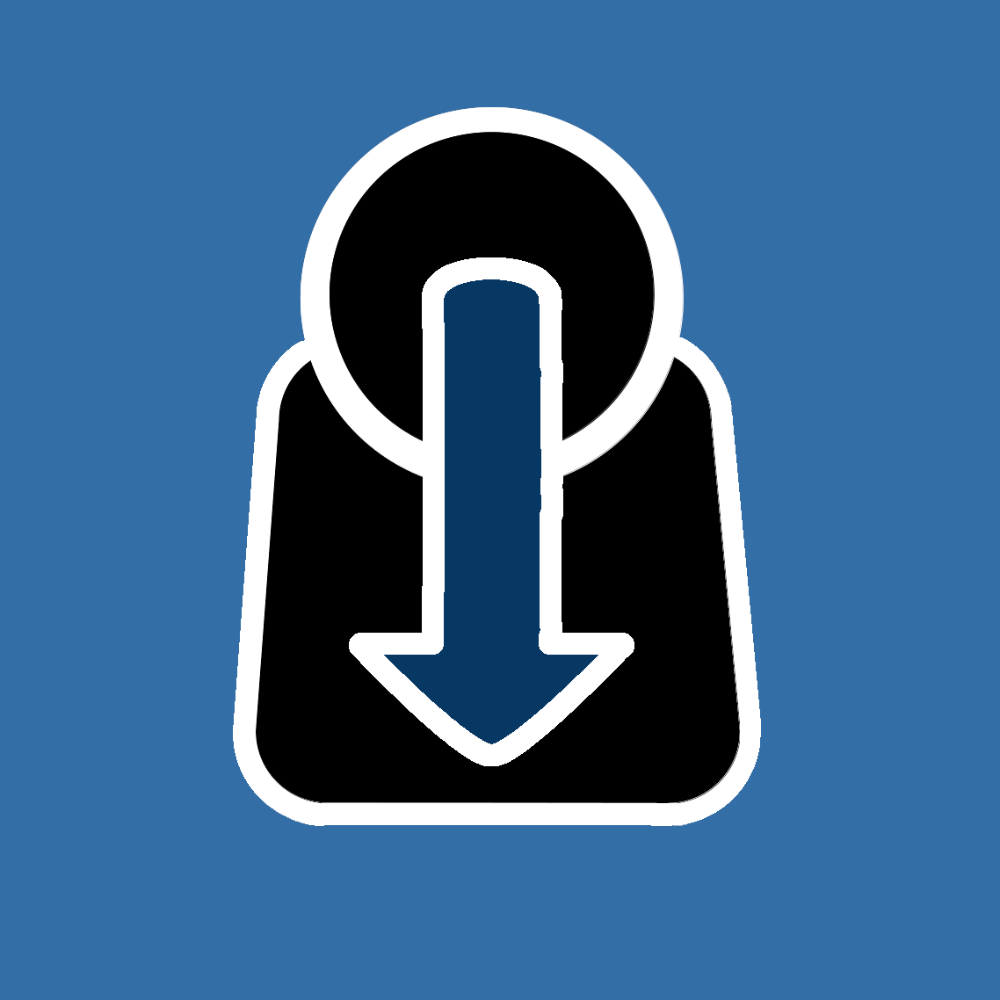

# 🛡️ Self-Examination App

<p align="left">
  
</p>

A powerful, private, and intuitive tool for spiritual and personal growth. Based on the traditions of William Booth and John Wesley, this app helps you track your journey of holiness through structured self-reflection.

## 📱 Screenshots

<p align="center">
  
  
</p>

## 🌟 Key Features

### 📊 Advanced Data Visualization
- **Timeline Chart**: Track your progress over days, weeks, months, or years with beautiful area charts and trend lines.
- **Comparison View**: Compare different time periods (e.g., this month vs. last month) to see where you've improved.
- **Radar Analysis**: A unique geometric representation of your spiritual "shape," including an overall average reference circle.
- **Deep-Dive Inspector**: Filter specific questions and swipe through your historical notes directly within the charts.

### 📝 Granular Input
- **Continuous 0-100% Scale**: More precise than simple ratings, allowing for nuanced self-reflection.
- **Per-Question Notes**: Document the "why" behind every answer. Notes are stored chronologically and accessible during analysis.
- **Localized Guidance**: Each question set includes helpful tips and biblical references to guide your growth.

### 🔒 Privacy & Security First
- **Biometric App Lock**: Protect your most personal reflections with Fingerprint, FaceID, or system PIN.
- **Local-Only Storage**: Your data never leaves your device. No cloud, no tracking, total privacy.
- **GDPR Compliant**: Full transparency on data handling through integrated privacy dialogs.

### 📂 Data Portability
- **CSV Export**: Export your history in three detail levels (Full Data, Values only, or Averages) to keep for your own records or share with a mentor.

## 📚 Integrated Question Sets
Currently, the app includes three rigorously curated sets:
1. **The Ten Commandments**: Reflecting on the foundational moral law.
2. **William Booth's Self-Denial**: Questions used by the founder of the Salvation Army.
3. **John Wesley's 22 Questions**: The daily examination used by the founder of Methodism.

## 🛠️ Installation

1. **Install Flutter:** [Flutter Installation Guide](https://flutter.dev/docs/get-started/install)
2. **Clone the Project:**
   ```bash
   git clone https://github.com/Paradoxianer/self_examintion.git
   ```
3. **Install Dependencies:**
   ```bash
   flutter pub get
   ```
4. **Run the Application:**
   ```bash
   flutter run
   ```

## 🌍 Supported Languages
The app is fully localized in:
- 🇩🇪 German (de)
- 🇺🇸 English (en)
- 🇪🇸 Spanish (es)
- 🇰🇷 Korean (ko)
- 🇱🇹 Lithuanian (lt)
- 🇵🇱 Polish (pl)
- 🇺🇦 Ukrainian (uk)
- 🇷🇺 Russian (ru)

## 🤝 Contributing
Contributions to improve the app or add more localized question sets are welcome! Please follow modern Flutter standards and ensure all tests pass.

## 👤 Author
**Matthias Lindner** (@Paradoxianer)

## 📄 License
This project is licensed under the MIT License - see the [LICENSE](LICENSE) file for details.
